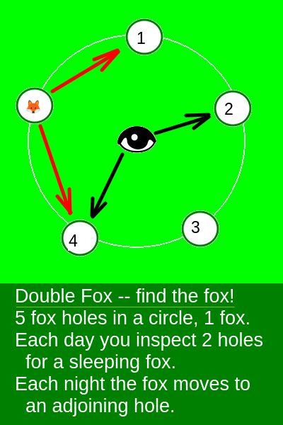
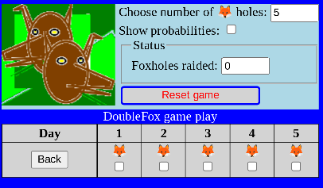
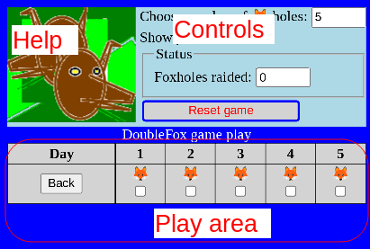
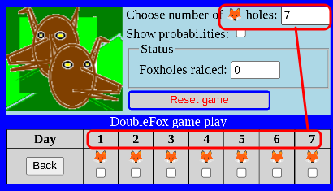
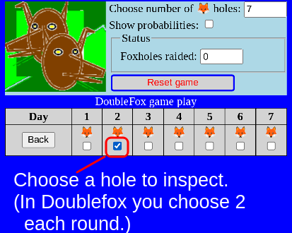
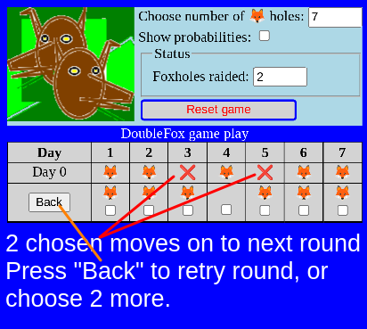
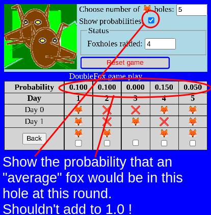

# Doublefox

This is an extension of the [Foxhole game](https://alfille.github.io/foxhole.github.io/) sent to me by my friend DSK.

## Quick link:
[Try Doublefox online now](https://alfille.github.io/doublefox.github.io/)

## Summary

This program is a way to test strategies.

The game is the catch a fox who must move between your hole inspections. The fox moves one hole in either direction. You can look at 2 holes each day.

## Schrödinger's fox

The program shows a [superposition](https://en.wikipedia.org/wiki/Schr%C3%B6dinger%27s_cat) of all the positions the fox could be hiding. Your checking of the holes helps collapse the possibilities.

## Screenshots

The initial game screen.

The controls are above, and the game is played below.

You can choose the number of foxholes

You check off the holes you want to inspect.

Checking 2 holes is enough for one day!

The fox then moves overnight and you have to look again.

How likely is the fox to be in this hole?

## Other games

If you haven't tried [Foxholes](https://alfille.github.io/foxhole.github.io/), you should. The game is very similar, but the strategy strikingly different.

## Platform

Pure *Javascript* in any (modern) browser.

Runs in the browser, so low bandwidth. No advertising. Just Free.

## Author

Paul Alfille paul.alfille@gmail.com

## License

MIT (free for any use)

## Code

[Freely available](https://github.com/alfille/doublefox.github.io)
